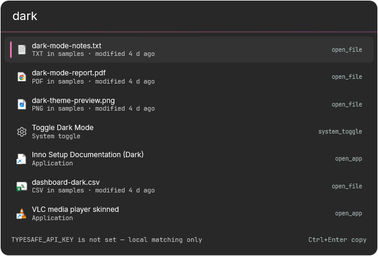

# Jev Launcher

Launcher tipo Spotlight para Windows (**Alt+Space**) que indexa apps, archivos y toggles,
y usa **Jev (TypeSafe)** para re-rankear los resultados segun la intencion.



## Caracteristicas

- **Panel frameless** con Alt+Space (o el icono de bandeja). Tema oscuro estilo TypeSafe.
- **Indice local**: apps del Menu Inicio (`.lnk`), apps de la Store/UWP (`shell:AppsFolder`),
  archivos de las carpetas configuradas (Downloads, Escritorio, Documentos por defecto)
  y 7 toggles del sistema.
- **Jev** decide `target`, `action` y `ready` en una sola llamada y re-rankea en vivo.
  Sin key funciona igual en modo local (fuzzy + calculadora + toggles).
- **Ranking que aprende**: registra lo que abris y lo prioriza por frecuencia y recencia.
- **Guard local**: un match exacto no lo pisa Jev.
- **Iconos reales** de apps y archivos.
- **Acciones secundarias** con `Ctrl+K` (copiar ruta/URL, abrir carpeta, revelar, buscar en la web)
  y `Ctrl+Enter` para copiar la ruta o URL.
- **Comandos** `/` (web, redes, servicios, archivos, utilidades…).
- **Toggles**: modo oscuro, Wi-Fi, suspender, bloquear, vaciar papelera, archivos ocultos, silenciar.
- **Bandeja** con Toggle / Settings / Quit. Arranca con Windows (configurable).

## Requisitos

- Windows 10/11 x64.
- **.NET 10 Desktop Runtime** ([descarga](https://dotnet.microsoft.com/download/dotnet/10.0)).
- Opcional: `TYPESAFE_API_KEY` para el re-ranking con Jev.

## Instalacion

Para regenerar **ambos** artefactos (ZIP y Setup) desde un unico publish: `.\installer\build-all.ps1`
(requiere Inno Setup 6). Los scripts de abajo generan cada uno por separado.

### Instalador (Inno Setup)

`installer\dist\JevLauncher-Setup-<version>.exe` — wizard, sin admin:
instala en `%LOCALAPPDATA%\Programs\JevLauncher`, crea accesos y entrada de desinstalacion,
y chequea el runtime de .NET.

Para regenerarlo:

```powershell
.\installer\build-inno.ps1            # requiere Inno Setup 6
```

### ZIP con scripts

`installer\dist\JevLauncher-<version>.zip` — descomprimir y doble clic en `install.cmd`
(equivalente; `uninstall.cmd` para sacarlo).

```powershell
.\installer\build.ps1
```

## Uso

| Atajo | Accion |
|---|---|
| `Alt+Space` | Abrir/cerrar el panel |
| Arriba / Abajo | Mover la seleccion |
| `Enter` | Ejecutar la fila |
| `Ctrl+Enter` | Copiar la ruta o URL de la fila |
| `Ctrl+K` | Menu de acciones de la fila |
| `Esc` | Volver / cerrar |

## Comandos

Escribi `/` para ver el menu completo.

- **Web**: `/web` `/search` `/ddg` `/bing` `/yt` `/gh` `/wiki` `/so` `/maps` `/img`
- **Redes**: `/x` `/reddit` `/ig` `/tiktok` `/li` `/fb` `/bsky` `/hn`
- **Servicios**: `/spotify` `/netflix` `/ytmusic` `/twitch` `/prime` `/disney`
- **Local**: `/file` `/find` `/app` `/toggle` `/recent` `/calc`
- **Utilidades**: `/snip` `/clip` `/uuid` `/b64` `/b64d` `/hash` `/color` `/win` `/note` `/timer`
- **App**: `/settings` `/quit` `/help` `/stats` `/reindex`

Detalles: los comandos web **sin argumento abren el sitio** (`/netflix`) y **con argumento buscan**
(`/netflix dark`). `/spotify` abre la **app de escritorio** si el esquema `spotify:` esta registrado.
`/find` consulta el indice de **Windows Search** (todo el equipo).

## Configuracion

`%APPDATA%\JevLauncher\settings.json` (las API keys se guardan **cifradas con DPAPI**):

- `EncryptedApiKey` (TypeSafe). El resto son ajustes de UI y comportamiento.
- `HotKey`, `SearchTemplate`, `Snippets`, `StartWithWindows`, `IndexFolders`.

Tambien se puede usar la variable de entorno `TYPESAFE_API_KEY` (tiene prioridad).

Datos de runtime (redirigibles con `JEV_LAUNCHER_DATA`):

- `usage.json` (ranking), `notes.txt` (notas), `settings.json`.

## Arquitectura

- **`JevLauncher.Core`** (net10.0-windows, sin UI): indice, fuzzy, prefilter, calculadora,
  ranker, cliente Jev, executor, toggles, comandos, utilidades, stats, busqueda global.
- **`JevLauncher.App`** (WPF): panel, hotkey, bandeja, settings, iconos, tema.
- **`tools/JevProbe`**: CLI para probar contra la API real de Jev.
- **`installer/`**: scripts de empaquetado (ZIP y Inno Setup).

Ver `docs/plans/` para el diseno y los planes por feature.

## Desarrollo

```powershell
dotnet build                 # compila la solucion
dotnet test                  # tests (xUnit, sin red)
.\run.ps1                    # ejecuta la app

# Smoke: ejercita la UI real y escribe reporte + PNGs en bin\...\artifacts\
$env:JEV_SMOKE_OPEN = "/app calculadora"     # opcional: prueba abrir una app
dotnet run --project src/JevLauncher.App -- --smoke
```

Variables utiles:

- `JEV_LAUNCHER_DEBUG=1` — log de diagnostico (`artifacts\jev-toggle.log`).
- `JEV_LAUNCHER_DATA=<ruta>` — carpeta de datos (por defecto `%APPDATA%\JevLauncher`).
- `JEV_ARTIFACTS=<ruta>` — carpeta de reportes/PNGs (por defecto `artifacts\` junto al exe).

## Ejecutar el launcher en segundo plano

La app es single-instance: si ya corre, volver a ejecutarla **muestra el panel**
(en lugar de abrir otra copia). Cerrar el panel (Alt+F4) lo oculta; solo termina
desde la bandeja (**Quit**) o `/quit`.

## Limitaciones conocidas

- Los resultados web **no** se muestran inline (se abre el navegador).
- El historial de portapapeles vive **solo en memoria** de la sesion.
- La busqueda de archivos depende del indice de Windows Search; sin el, usa las carpetas configuradas.

## Licencia y creditos

Fuentes incluidas: **Inter** y **JetBrains Mono** (SIL OFL, ver `src/JevLauncher.App/Fonts/`).
Icono y tema inspirados en [typesafe.ai](https://typesafe.ai/).
